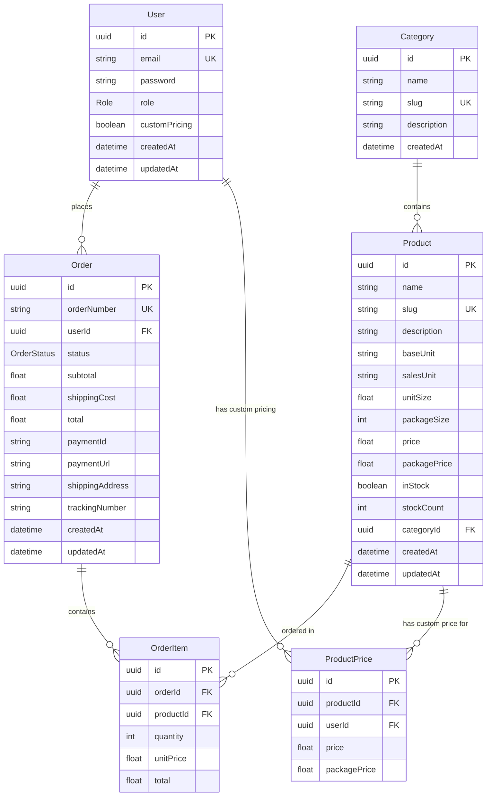

# Databázové schéma

## Aktualizované Prisma Schema

```prisma
generator client {
  provider = "prisma-client-js"
}

datasource db {
  provider = "postgresql"
  url      = env("DATABASE_URL")
}

model User {
  id            String   @id @default(uuid())
  email         String   @unique
  password      String
  role          Role     @default(CUSTOMER)
  customPricing Boolean  @default(false)
  createdAt     DateTime @default(now())
  updatedAt     DateTime @updatedAt
  
  // Relations
  orders        Order[]
  customPrices  ProductPrice[]
  
  @@map("users")
}

model Category {
  id          String    @id @default(uuid())
  name        String
  slug        String    @unique
  description String?
  createdAt   DateTime  @default(now())
  
  // Relations
  products    Product[]
  
  @@map("categories")
}

model Product {
  id          String   @id @default(uuid())
  name        String
  slug        String   @unique
  description String?
  
  // Pricing & Units
  baseUnit    String   // "l", "kg", "ks"
  salesUnit   String   // "ks", "bal"
  unitSize    Float    // 1 ks = 1 litr
  packageSize Int?     // 1 bal = 6 ks
  
  // Default pricing
  price       Float
  packagePrice Float?
  
  // Inventory
  inStock     Boolean  @default(true)
  stockCount  Int?
  
  // Meta
  categoryId  String
  createdAt   DateTime @default(now())
  updatedAt   DateTime @updatedAt
  
  // Relations
  category     Category       @relation(fields: [categoryId], references: [id])
  orderItems   OrderItem[]
  customPrices ProductPrice[]
  
  @@map("products")
}

model ProductPrice {
  id           String @id @default(uuid())
  productId    String
  userId       String
  price        Float
  packagePrice Float?
  
  // Relations
  product Product @relation(fields: [productId], references: [id])
  user    User    @relation(fields: [userId], references: [id])
  
  @@unique([productId, userId])
  @@map("product_prices")
}

model Order {
  id           String      @id @default(uuid())
  orderNumber  String      @unique // ORD-2024-001
  
  // Customer
  userId       String
  
  // Status & Totals
  status       OrderStatus @default(PENDING)
  subtotal     Float
  shippingCost Float       @default(0)
  total        Float
  
  // Payment
  paymentId    String?     // Comgate payment ID
  paymentUrl   String?     // Comgate payment URL
  
  // Shipping
  shippingAddress String?
  trackingNumber  String?
  
  // Meta
  createdAt    DateTime    @default(now())
  updatedAt    DateTime    @updatedAt
  
  // Relations
  user         User        @relation(fields: [userId], references: [id])
  items        OrderItem[]
  
  @@map("orders")
}

model OrderItem {
  id        String @id @default(uuid())
  orderId   String
  productId String
  
  // Pricing at time of order
  quantity  Int
  unitPrice Float
  total     Float
  
  // Relations
  order   Order   @relation(fields: [orderId], references: [id], onDelete: Cascade)
  product Product @relation(fields: [productId], references: [id])
  
  @@map("order_items")
}

// Enums
enum Role {
  CUSTOMER
  ADMIN
}

enum OrderStatus {
  PENDING     // Vytvořena, čeká na platbu
  PAID        // Zaplacena, zpracovává se
  PROCESSING  // Balí se
  SHIPPED     // Odesláno
  DELIVERED   // Doručeno
  CANCELLED   // Zrušena
}
```

## Entity Relationship Diagram



## Indexy pro optimalizaci

```sql
-- Nejčastější queries
CREATE INDEX idx_products_category ON products(category_id);
CREATE INDEX idx_products_slug ON products(slug);
CREATE INDEX idx_orders_user ON orders(user_id);
CREATE INDEX idx_orders_status ON orders(status);
CREATE INDEX idx_orders_created ON orders(created_at);
CREATE INDEX idx_order_items_order ON order_items(order_id);
CREATE INDEX idx_product_prices_user_product ON product_prices(user_id, product_id);
```

## Seed Data Example

```javascript
// prisma/seed.js
const categories = [
  { name: 'Sirupy', slug: 'sirupy' },
  { name: 'Toppings', slug: 'toppings' },
  { name: 'Prášky & Směsi', slug: 'prasky-smesi' },
  { name: 'Vybavení', slug: 'vybaveni' },
  { name: 'Čaje', slug: 'caje' }
]

const products = [
  {
    name: 'Sirup Jahoda',
    slug: 'sirup-jahoda',
    baseUnit: 'l',
    salesUnit: 'ks',
    unitSize: 1.0,
    packageSize: 6,
    price: 150,
    packagePrice: 850,
    categoryId: 'sirupy-id'
  }
]
```

## Migration Strategy

### 1. Initial Migration
```bash
npx prisma migrate dev --name init
```

### 2. Add Custom Pricing
```bash
npx prisma migrate dev --name add-custom-pricing
```

### 3. Add Order Tracking
```bash
npx prisma migrate dev --name add-order-tracking
``` 