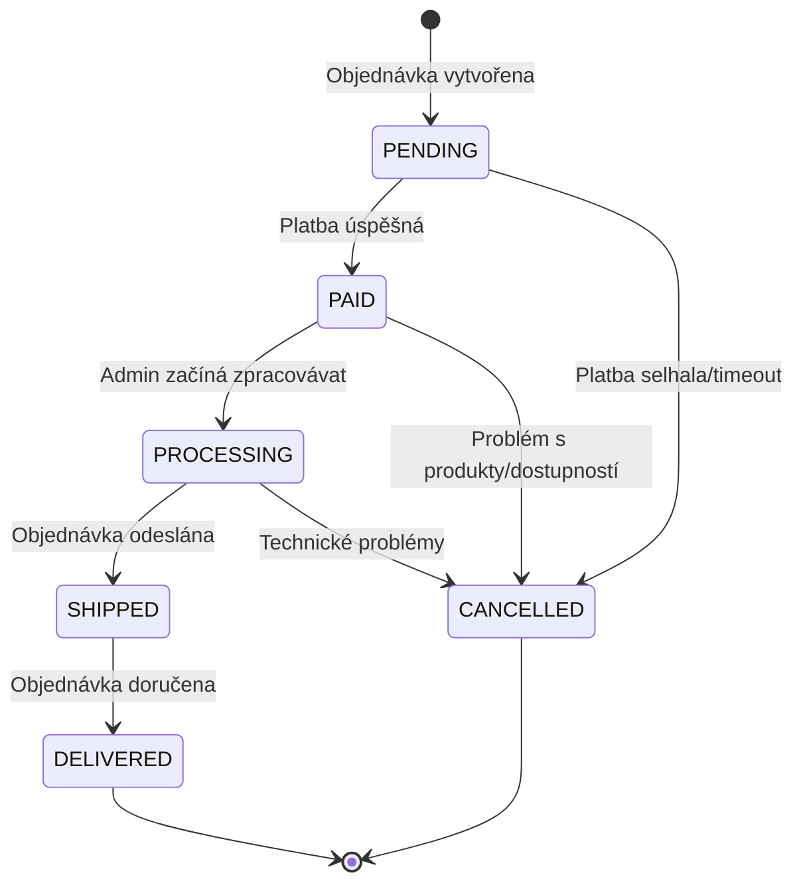

# Životní cyklus objednávky

## Stavy objednávky



## Detailní popis stavů

### 1. PENDING
**Kdy:** Objednávka byla vytvořena, ale ještě nebyla zaplacena
**Trvání:** 15 minut (timeout Comgate)
**Akce:**
- Odeslaní potvrzovacího emailu
- Rezervace produktů v košíku (v Redis)
- Vygenerování Comgate platebního odkazu

```javascript
// Email template: Potvrzení objednávky
Subject: "Potvrzení objednávky #ORD-2024-001"
- Číslo objednávky
- Seznam produktů
- Celková cena
- Odkaz na platbu
- Upozornění na 15min timeout
```

### 2. PAID
**Kdy:** Platba byla úspěšně zpracována Comgate
**Trvání:** 1-2 pracovní dny
**Akce:**
- Aktualizace order status v DB
- Odeslaní email o přijaté platbě
- Notifikace adminovi o nové objednávce
- Přesun z Redis cache do trvalého úložiště

```javascript
// Email template: Platba přijata
Subject: "Platba přijata - objednávka #ORD-2024-001"
- Potvrzení platby
- Odhadovaný čas zpracování
- Kontaktní informace
```

### 3. PROCESSING
**Kdy:** Admin začal zpracovávat objednávku
**Trvání:** 1-3 pracovní dny
**Akce:**
- Admin označí objednávku jako zpracovávanou
- Email zákazníkovi o zpracování
- Kontrola dostupnosti produktů
- Příprava balíčku

```javascript
// Email template: Zpracování objednávky  
Subject: "Zpracováváme vaši objednávku #ORD-2024-001"
- Informace o zpracování
- Odhadovaný čas odeslání
- Možnost kontaktu
```

### 4. SHIPPED
**Kdy:** Objednávka byla odeslána dopravcem
**Trvání:** 1-3 dny (dle dopravce)
**Akce:**
- Admin zadá tracking číslo
- Email s tracking informacemi
- Aktualizace order status

```javascript
// Email template: Objednávka odeslána
Subject: "Objednávka odeslána #ORD-2024-001"
- Tracking číslo
- Odkaz na sledování
- Kontakt na dopravce
- Odhadovaný čas doručení
```

### 5. DELIVERED
**Kdy:** Objednávka byla doručena (pokud máme tracking)
**Trvání:** Finální stav
**Akce:**
- Automatická nebo manuální změna stavu
- Email s poděkováním
- Možnost hodnocení/recenze

```javascript
// Email template: Objednávka doručena
Subject: "Objednávka doručena #ORD-2024-001"
- Poděkování za nákup
- Odkaz na hodnocení
- Informace o reklamacích
- Nabídka dalších produktů
```

### 6. CANCELLED
**Kdy:** Objednávka byla zrušena (různé důvody)
**Důvody:**
- Neúspěšná platba
- Nedostupnost produktů
- Zákazník zrušil
- Technické problémy

```javascript
// Email template: Objednávka zrušena
Subject: "Objednávka zrušena #ORD-2024-001"
- Důvod zrušení
- Informace o refundaci (pokud byla platba)
- Kontaktní informace
- Nabídka pomoci
```

## Automatizace přechodů

### Webhook Comgate
```javascript
// src/routes/webhooks/comgate.js
app.post('/webhooks/comgate', async (req, res) => {
  const { orderId, status, signature } = req.body
  
  // Ověření signature
  if (!verifyComgateSignature(req.body, signature)) {
    return res.status(401).send('Invalid signature')
  }
  
  // Aktualizace objednávky
  if (status === 'PAID') {
    await updateOrderStatus(orderId, 'PAID')
    await sendOrderPaidEmail(orderId)
    await notifyAdminNewOrder(orderId)
  }
  
  res.status(200).send('OK')
})
```

### Admin Actions
```javascript
// GraphQL mutations pro admin
const adminMutations = {
  updateOrderStatus: async (orderId, newStatus) => {
    // Validace přechodu
    const validTransitions = {
      PAID: ['PROCESSING', 'CANCELLED'],
      PROCESSING: ['SHIPPED', 'CANCELLED'],
      SHIPPED: ['DELIVERED']
    }
    
    // Aktualizace + email
    await updateOrder(orderId, newStatus)
    await sendStatusChangeEmail(orderId, newStatus)
  }
}
```

## Email Templates

### Base Template
```html
<!-- src/templates/email-base.html -->
<!DOCTYPE html>
<html>
<head>
  <style>
    .container { max-width: 600px; margin: 0 auto; }
    .header { background: #2563eb; color: white; padding: 20px; }
    .content { padding: 20px; }
    .footer { background: #f3f4f6; padding: 20px; }
  </style>
</head>
<body>
  <div class="container">
    <div class="header">
      <h1>Lootea B2B</h1>
    </div>
    <div class="content">
      {{content}}
    </div>
    <div class="footer">
      <p>Kontakt: support@lootea.cz | +420 123 456 789</p>
    </div>
  </div>
</body>
</html>
```

## Monitoring & Analytics

### Metriky
```javascript
// Sledování výkonu
const orderMetrics = {
  'pending_to_paid_time': 'Čas od vytvoření do platby',
  'paid_to_shipped_time': 'Čas zpracování objednávky', 
  'shipped_to_delivered_time': 'Čas doručení',
  'cancellation_rate': 'Míra zrušení objednávek',
  'payment_success_rate': 'Úspěšnost plateb'
}
```

### Alerts
```javascript
// Upozornění pro admin
const alerts = {
  'payment_timeout': 'Platba nebyla dokončena za 10 minut',
  'stuck_in_processing': 'Objednávka je ve zpracování > 3 dny',
  'high_cancellation_rate': 'Vysoká míra zrušení (>5%)'
}
``` 