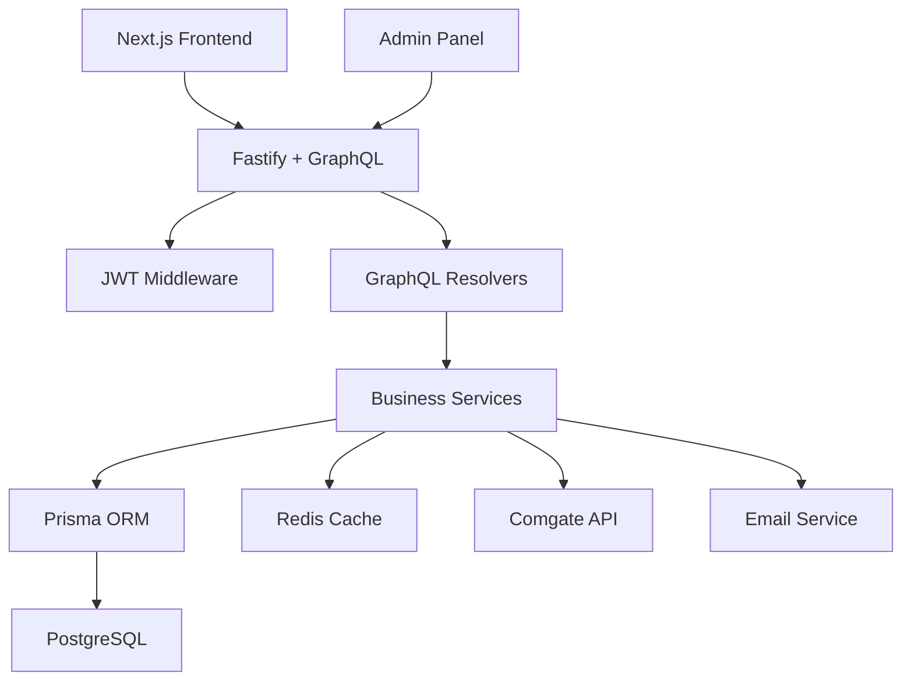

# Přehled systému

## Tech Stack

### Backend
- **Node.js** - Runtime environment
- **Fastify** - Web framework (rychlejší než Express)
- **Apollo Server** - GraphQL server s Fastify integrací
- **Prisma** - ORM a database toolkit
- **PostgreSQL** - Relační databáze
- **Redis** - Cache a session storage
- **JWT** - Autentizace
- **Nodemailer** - Email handling

### External Services
- **Comgate V2** - Platební brána
- **Railway** - Hosting platform
- **SendGrid/Gmail** - SMTP služba

## Architektura systému



## User Roles & Permissions

### B2B Customer
```javascript
permissions: [
  'auth:login',
  'auth:register', 
  'products:read',
  'cart:manage',
  'orders:create',
  'orders:read_own',
  'profile:update'
]
```

### Admin
```javascript
permissions: [
  'products:write',
  'categories:write', 
  'orders:read_all',
  'orders:update_status',
  'users:read',
  'users:update_pricing',
  'analytics:read'
]
```

## Datový tok

### 1. Registrace zákazníka
```
Frontend → register mutation → 
Hash password → Save to DB → 
Send welcome email → Return JWT
```

### 2. Vytvoření objednávky
```
Frontend → createOrder mutation →
Validate cart → Check inventory →
Calculate total → Create order (PENDING) →
Initiate Comgate payment → Return payment URL
```

### 3. Potvrzení platby
```
Comgate webhook → Verify signature →
Update order status (PAID) →
Send confirmation email →
Update inventory
```

## Bezpečnost

### Autentizace
- JWT access tokens (15 min expiry)
- Refresh tokens (7 days expiry)
- Token blacklisting v Redis
- Password hashing s bcrypt

### API Security
- Rate limiting na GraphQL endpointy
- Input validation s Joi
- SQL injection protection (Prisma)
- CORS konfigurace

### Data Protection
- Hesla hashována s bcrypt (rounds: 12)
- Sensitive data v environment variables
- HTTPS only v production
- Database connection pool limits

## Performance

### Caching Strategy
```javascript
// Redis cache keys
products:all           // 1 hour
product:{id}          // 6 hours  
user:{id}:cart        // 24 hours
categories:all        // 12 hours
```

### Database Optimization
- Database indexy na často používané sloupce
- Connection pooling
- Pagination pro velké datové sady
- Optimalizované Prisma queries

## Monitoring & Logging

### Application Logs
```javascript
levels: {
  error: 'Database errors, payment failures',
  warn: 'Low inventory, failed login attempts',
  info: 'User actions, order status changes',
  debug: 'SQL queries, Redis operations'
}
```

### Health Checks
- `/health` - Basic server status
- Database connectivity
- Redis connectivity  
- External API status (Comgate)

## Scalability Considerations

### Horizontal Scaling
- Stateless server design
- Redis pro sdílený state
- Database connection pooling
- Load balancer ready

### Vertical Scaling
- Efficient memory usage
- CPU optimalizace s Fastify
- Database query optimization
- Redis memory management 