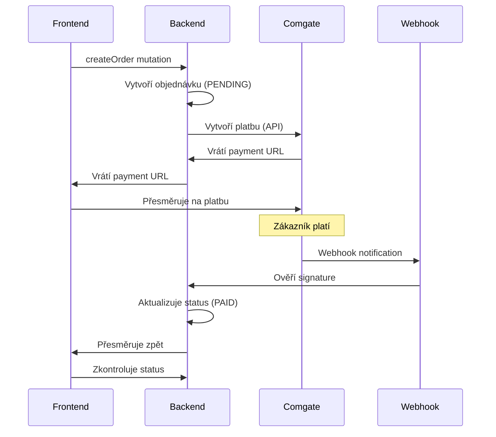

# Platební systém - Comgate V2

## Přehled platebního toku



## Comgate V2 API Integrace

### 1. Vytvoření platby
```javascript
// src/services/payment.js
const createComgatePayment = async (order) => {
  const paymentData = {
    merchantId: process.env.COMGATE_MERCHANT_ID,
    test: process.env.COMGATE_TEST_MODE === 'true',
    amount: {
      value: Math.round(order.total * 100), // v haléřích
      currency: 'CZK'
    },
    description: `Objednávka #${order.orderNumber}`,
    referenceId: order.id,
    paymentMethods: ['CARD', 'APPLE_PAY'], // Povolené metody
    customer: {
      email: order.user.email
    },
    
    // Callback URLs
    redirectUrls: {
      success: `${process.env.FRONTEND_URL}/order/success`,
      failure: `${process.env.FRONTEND_URL}/order/failed`
    },
    
    // Webhook
    webhookUrl: `${process.env.BACKEND_URL}/webhooks/comgate`
  }
  
  // API call - Comgate V2 REST API
  const response = await fetch('https://payments.comgate.cz/v2.0/create', {
    method: 'POST',
    headers: { 
      'Content-Type': 'application/json',
      'Authorization': `Bearer ${process.env.COMGATE_API_KEY}`
    },
    body: JSON.stringify(paymentData)
  })
  
  const result = await response.json()
  
  // V2 API vrací JSON response
  if (result.success) {
    return {
      transactionId: result.data.transactionId,
      paymentUrl: result.data.paymentUrl
    }
  }
  
  throw new Error(`Comgate V2 error: ${result.error.message}`)
}
```

### 2. Signature generation
```javascript
// src/utils/comgate.js
const generateComgateSignature = (data) => {
  const secret = process.env.COMGATE_SECRET
  
  // Seřazení klíčů abecedně
  const sortedKeys = Object.keys(data).sort()
  
  // Vytvoření řetězce pro hash
  const signatureString = sortedKeys
    .map(key => `${key}=${data[key]}`)
    .join('&') + secret
    
  // SHA256 hash
  return crypto
    .createHash('sha256')
    .update(signatureString, 'utf8')
    .digest('hex')
    .toUpperCase()
}

const verifyComgateSignature = (data, receivedSignature) => {
  const expectedSignature = generateComgateSignature(data)
  return expectedSignature === receivedSignature
}
```

## Webhook Handler

### 1. Základní webhook
```javascript
// src/routes/webhooks/comgate.js
const handleComgateWebhook = async (request, reply) => {
  try {
    const body = request.body
    
    // Ověření signature
    if (!verifyComgateSignature(body, body.signature)) {
      request.log.warn('Invalid Comgate signature', { body })
      return reply.status(401).send('INVALID_SIGNATURE')
    }
    
    const { refId, status, transId, fee } = body
    
    // Najdi objednávku
    const order = await prisma.order.findUnique({
      where: { id: refId },
      include: { user: true, items: { include: { product: true } } }
    })
    
    if (!order) {
      request.log.error('Order not found', { refId })
      return reply.status(404).send('ORDER_NOT_FOUND')
    }
    
    // Zpracuj podle statusu
    switch (status) {
      case 'PAID':
        await handlePaidOrder(order, transId, fee)
        break
      case 'CANCELLED':
        await handleCancelledOrder(order, 'PAYMENT_CANCELLED')
        break
      case 'TIMEOUT':
        await handleCancelledOrder(order, 'PAYMENT_TIMEOUT')
        break
    }
    
    return reply.send('OK')
    
  } catch (error) {
    request.log.error('Webhook error', error)
    return reply.status(500).send('ERROR')
  }
}
```

### 2. Zpracování zaplacené objednávky
```javascript
const handlePaidOrder = async (order, transactionId, fee) => {
  // Aktualizace objednávky
  const updatedOrder = await prisma.order.update({
    where: { id: order.id },
    data: {
      status: 'PAID',
      paymentId: transactionId,
      paymentFee: fee ? parseFloat(fee) : null
    }
  })
  
  // Vyčištění košíku z Redis
  await redis.del(`cart:${order.userId}`)
  
  // Email zákazníkovi
  await sendOrderPaidEmail(updatedOrder)
  
  // Notifikace adminovi
  await sendAdminOrderNotification(updatedOrder)
  
  // Analytics
  await trackOrderPaid(updatedOrder)
}
```

## GraphQL Mutations

### 1. Vytvoření objednávky
```graphql
mutation CreateOrder($input: CreateOrderInput!) {
  createOrder(input: $input) {
    id
    orderNumber
    status
    total
    paymentUrl
    createdAt
  }
}
```

```javascript
// src/schema/resolvers/order.js
const createOrder = async (parent, { input }, { user, prisma }) => {
  // Validace uživatele
  if (!user) throw new Error('UNAUTHORIZED')
  
  // Validace košíku
  const cart = await getCartFromRedis(user.id)
  if (!cart || cart.items.length === 0) {
    throw new Error('EMPTY_CART')
  }
  
  // Výpočet ceny s aktuálními cenami
  const calculatedTotal = await calculateOrderTotal(cart, user)
  
  // Vytvoření objednávky
  const order = await prisma.order.create({
    data: {
      orderNumber: generateOrderNumber(),
      userId: user.id,
      status: 'PENDING',
      subtotal: calculatedTotal.subtotal,
      shippingCost: calculatedTotal.shipping,
      total: calculatedTotal.total,
      shippingAddress: input.shippingAddress,
      items: {
        create: cart.items.map(item => ({
          productId: item.productId,
          quantity: item.quantity,
          unitPrice: item.unitPrice,
          total: item.quantity * item.unitPrice
        }))
      }
    },
    include: { user: true, items: { include: { product: true } } }
  })
  
  // Vytvoření Comgate platby
  const payment = await createComgatePayment(order)
  
  // Uložení payment URL
  await prisma.order.update({
    where: { id: order.id },
    data: { paymentUrl: payment.paymentUrl }
  })
  
  // Potvrzovací email
  await sendOrderConfirmationEmail(order)
  
  return {
    ...order,
    paymentUrl: payment.paymentUrl
  }
}
```

## Error Handling

### 1. Comgate Error Kódy
```javascript
const COMGATE_ERRORS = {
  '1301': 'Neplatný merchant',
  '1302': 'Neplatná částka',
  '1303': 'Neplatná měna',
  '1304': 'Neplatný popis platby',
  '1305': 'Neplatná metoda platby',
  '1306': 'Neplatný email',
  '1307': 'Neplatný telefon',
  '1308': 'Neplatná adresa',
  '1309': 'Neplatné datum',
  '1310': 'Neplatný čas',
  '1311': 'Neplatný podpis'
}

const handleComgateError = (errorCode) => {
  const message = COMGATE_ERRORS[errorCode] || 'Neznámá chyba'
  throw new Error(`COMGATE_ERROR: ${message}`)
}
```

### 2. Retry mechanismus
```javascript
const createPaymentWithRetry = async (order, maxRetries = 3) => {
  for (let attempt = 1; attempt <= maxRetries; attempt++) {
    try {
      return await createComgatePayment(order)
    } catch (error) {
      if (attempt === maxRetries) throw error
      
      // Exponential backoff
      await new Promise(resolve => 
        setTimeout(resolve, Math.pow(2, attempt) * 1000)
      )
    }
  }
}
```

## Testing

### 1. Test credentials
```env
# Test environment - Comgate V2
COMGATE_MERCHANT_ID="test_merchant"
COMGATE_API_KEY="test_api_key_v2"
COMGATE_SECRET="test_webhook_secret"
COMGATE_TEST_MODE=true
```

### 2. Mock webhook pro development
```javascript
// src/utils/test-webhook.js
const mockComgateWebhook = async (orderId, status = 'PAID') => {
  const webhookData = {
    refId: orderId,
    status: status,
    transId: 'TEST_' + Date.now(),
    fee: '2.50'
  }
  
  const signature = generateComgateSignature(webhookData)
  webhookData.signature = signature
  
  // Pošli na webhook endpoint
  await fetch('http://localhost:3000/webhooks/comgate', {
    method: 'POST',
    headers: { 'Content-Type': 'application/json' },
    body: JSON.stringify(webhookData)
  })
}
```

## Monitoring & Alerting

### 1. Payment metriky
```javascript
const paymentMetrics = {
  'payment_success_rate': 'Úspěšnost plateb (%)',
  'average_payment_time': 'Průměrný čas platby',
  'webhook_response_time': 'Rychlost zpracování webhooků',
  'failed_payments_count': 'Počet neúspěšných plateb'
}
```

### 2. Alerts
```javascript
// Upozornění při problémech
const paymentAlerts = {
  'webhook_timeout': 'Webhook nebyl zpracován > 30s',
  'low_success_rate': 'Úspěšnost plateb < 95%',
  'signature_mismatch': 'Neplatný podpis webhooků'
}
``` 