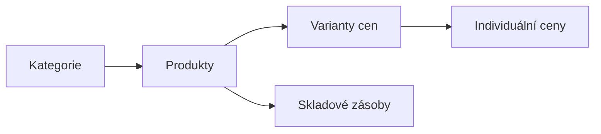
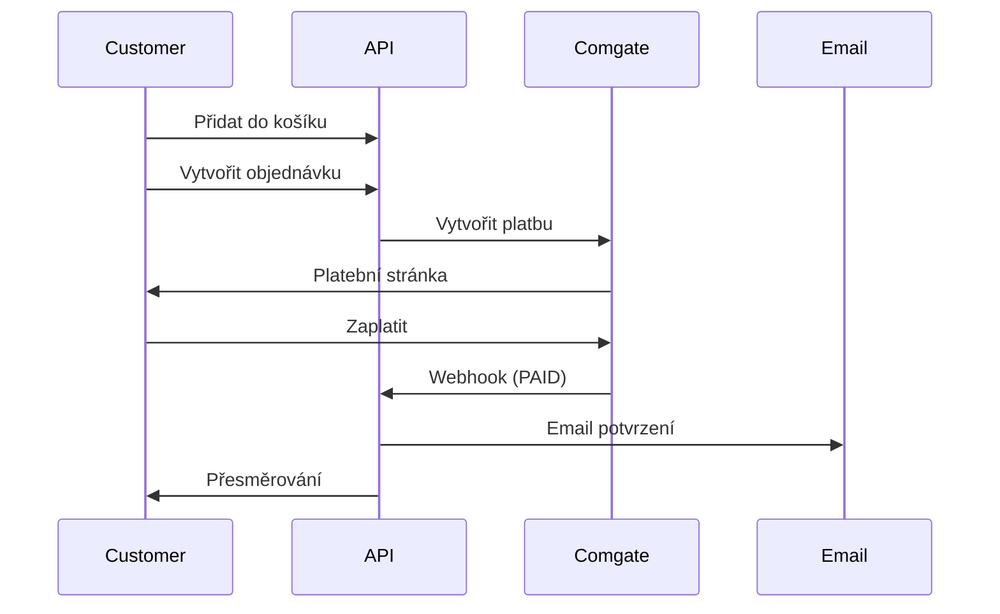

# B2B Bubble Tea E-shop Backend

Vitejte v dokumentaci pro B2B e-shop backend! Tento projekt poskytuje kompletní API pro Next.js frontend s focus na jednoduchost a výkon.

## 🎯 Přehled projektu

**Tech Stack:**
- **Node.js** + **Fastify** - Rychlý web framework
- **GraphQL** (Mercurius) - Flexibilní API
- **PostgreSQL** + **Prisma** - Databáze a ORM
- **Redis** - Cache a session storage
- **JWT** - Autentizace
- **Comgate V2** - Platební brána
- **Railway** - Cloud hosting

**Hlavní funkce:**
- 🔐 JWT autentizace s refresh tokeny
- 🛍️ Košík uložený v Redis
- 📦 Komplexní správa objednávek
- 💳 Comgate V2 platby
- 📧 Email notifikace
- 👨‍💼 Admin panel pro správu
- 💰 Individuální ceny pro zákazníky
- 📊 Monitoring a analytics

## 🚀 Quick Start

```bash
# 1. Klonování
git clone <repository-url>
cd b2b-eshop-backend

# 2. Instalace
npm install

# 3. Environment setup
cp .env.example .env
# Edituj .env soubor

# 4. Databáze
npx prisma migrate dev
npx prisma db seed

# 5. Spuštění
npm run dev
```

**Dostupné endpointy:**
- GraphQL API: http://localhost:3000/graphql
- GraphQL Playground: http://localhost:3000/graphiql
- Health check: http://localhost:3000/health

## 📚 Dokumentace

### 🔧 Setup & Konfigurace
- [Instalace a nastavení](./01-setup-configuration/installation.md)
- [Environment setup](./01-setup-configuration/environment-setup.md)

### 🏗️ Systémová architektura
- [Přehled systému](./02-system-architecture/overview.md)
- [Databázové schéma](./02-system-architecture/database-design.md)
- [Životní cyklus objednávky](./02-system-architecture/order-lifecycle.md)
- [Platební systém](./02-system-architecture/payment-flow.md)

### 📡 API Dokumentace
- [GraphQL Schema](./03-api-documentation/graphql-schema.md)

### 🎨 Frontend integrace
- [Next.js setup](./04-frontend-integration/nextjs-setup.md)

### 🚀 Deployment
- [Railway deployment](./05-deployment/railway-setup.md)

## 🎯 Pro koho je tento projekt

### Frontend vývojář (Junior)
Máš připravenou:
- ✅ **Kompletní GraphQL API** - stačí poslat query/mutation
- ✅ **TypeScript types** - automaticky generované z schema
- ✅ **Dokumentované endpointy** - víš přesně co poslat
- ✅ **Error handling** - standardizované chyby
- ✅ **Authentication** - JWT tokeny ready to use

### Backend vývojář
Připravený základ pro:
- ✅ **Modulární architektura** - snadné rozšíření
- ✅ **Production ready** - security, monitoring, scalability
- ✅ **Testing setup** - jednotkové a integrační testy
- ✅ **Documentation** - vše zdokumentované

## 🛍️ Business logika

### Produkty & Kategorie


**Produktové kategorie:**
- 🥤 Sirupy
- 🍇 Toppings (Popping Balls, Tapioca)
- 🥄 Prášky & Směsi
- 🍃 Čaje
- 🥤 Vybavení

### Order Flow


## 🔧 Vývoj a údržba

### Přidání nového produktu
```graphql
mutation CreateProduct($input: CreateProductInput!) {
  createProduct(input: $input) {
    id
    name
    price
  }
}
```

### Správa objednávek
```graphql
mutation UpdateOrderStatus($orderId: ID!, $status: OrderStatus!) {
  updateOrderStatus(orderId: $orderId, status: $status) {
    id
    status
  }
}
```

### Individuální ceny
```graphql
mutation SetCustomPrice($userId: ID!, $productId: ID!, $price: Float!) {
  setCustomPrice(userId: $userId, productId: $productId, price: $price)
}
```

## 🚀 Roadmapa

### Fáze 1: Core Backend ✅
- [x] Fastify + GraphQL setup
- [x] JWT autentizace
- [x] Prisma + PostgreSQL
- [x] Základní CRUD operace

### Fáze 2: Business logika (v progressu)
- [ ] Košík a objednávky
- [ ] Comgate V2 integrace
- [ ] Email notifikace
- [ ] Admin funkcionalita

### Fáze 3: Production
- [ ] Railway deployment
- [ ] Monitoring a logging
- [ ] Performance optimalizace
- [ ] Security audit

### Fáze 4: Advanced funkce
- [ ] Analytics dashboard
- [ ] Inventory management
- [ ] Bulk operace
- [ ] API rate limiting

## 🤝 Kontakt a podpora

Pro otázky ohledně implementace nebo rozšíření funkcí, zkontroluj:
1. **Tuto dokumentaci** - možná už máme odpověď
2. **GraphQL Playground** - pro testování API
3. **Health check endpoint** - pro status služeb

**Tip pro efektivní vývoj:** Začni s GraphQL Playground, otestuj si queries/mutations, pak je implementuj do frontendu s Apollo Client!

---

*Připraveno s ❤️ pro rychlý a efektivní vývoj B2B e-shop řešení.*
